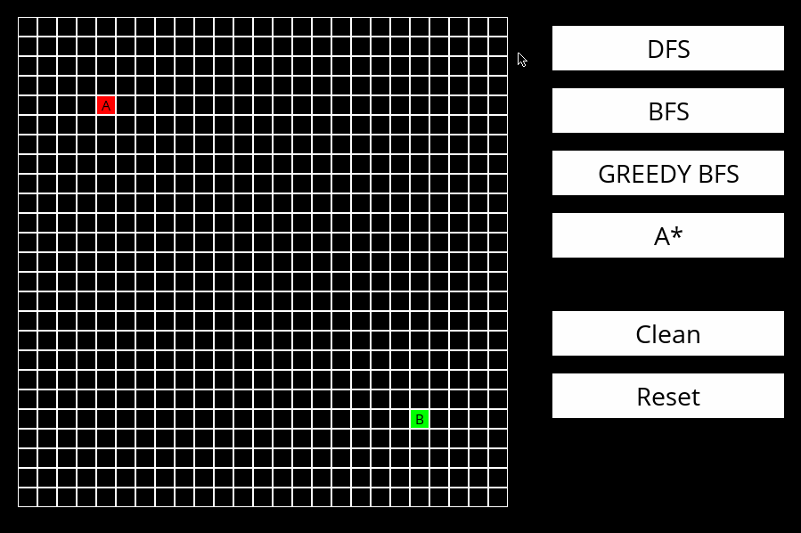
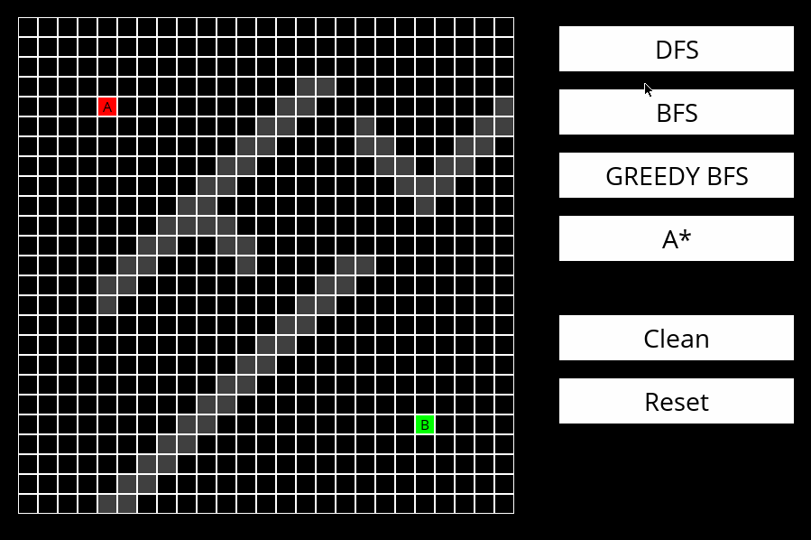
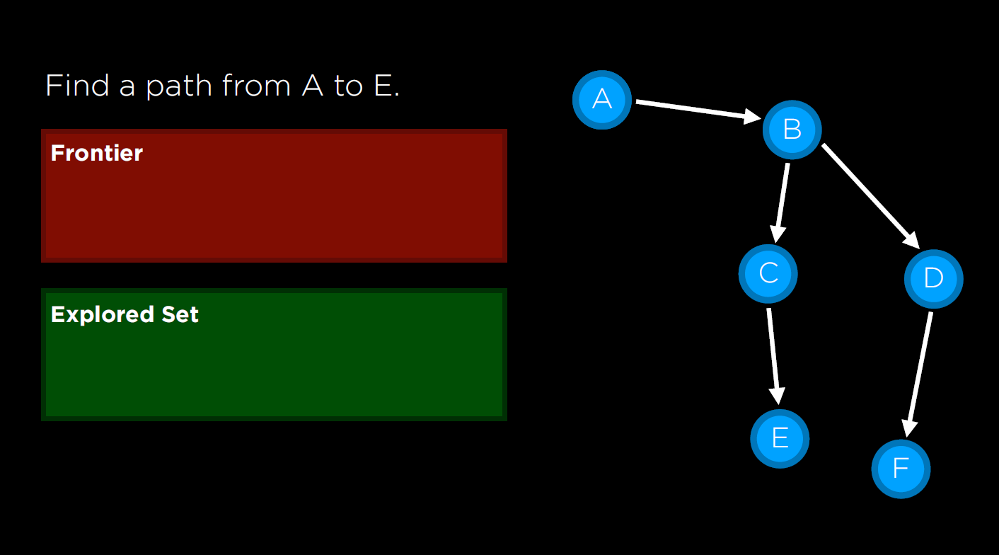

# Visual Graph Search

This is a game that allows you to visualize concepts and play with search algorithms for graph data structures.
The interface is implemented with PyGame, and allows you to draw walls and select the `start` and `end` positions.

For spanish version go to this [link](README_es.md).


Color reference:

-  Empty cell
-  Wall cell
-  Source cell
-  Target cell
-  Active cell (search algorithm is analizing this node)
-  Explored cell (search algorithm analized all the child nodes of this cell)
-  Path cell (best path as estimated by the algorithm)

Currently supports:

| Name                     |              | Type              | Wikipedia link                                      |
|--------------------------|--------------|-------------------|-----------------------------------------------------|
| Depth-first search       | `DFS`        | Uninformed search | https://en.wikipedia.org/wiki/Depth-first_search    |
| Breath-first search      | `BFS`        | Uninformed search | https://en.wikipedia.org/wiki/Breadth-first_search  |
| Greedy best-first search | `GREEDY_BFS` | Informed search   | https://en.wikipedia.org/wiki/Best-first_search     |
| A* search                | `A_STAR`     | Informed search   | https://en.wikipedia.org/wiki/A*_search_algorithm   |

## Getting started

These instructions will get you a copy of the project up and running on your local machine for development and testing purposes.

### Prerequisites

Ensure you have Python 3.7 or higher installed.

### Installation

Clone this repository and install requirements:
```
$ git clone https://github.com/nahueespinosa/visual_search.git
$ pip install -r requirements.txt
```

### Usage

Run the command:
```
$ python runner.py
```

## Ideas

There are lots of test you can make. Here is an example using another board size.




Feel free to download and experiment with the code. 

## Details

The data is internally represented as a graph to be solved by the algorithm.
Every node is a state in the system and the goal is to find a path between the starting state and the final state.



In the file `solver.py` you can find an abstract implementation of the search algorithms to use in another project.
There is just one `Solver` class and different types of frontier yield different behaviours.

```python
 # The algorithm selected determines the type of frontier to be used
frontier = StackFrontier() if algorithm == self.DFS else \
           QueueFrontier() if algorithm == self.BFS else \
           GreedyFrontier(lambda node: self.environment.cost_to_target(node.state)) if algorithm == self.GREEDY_BFS else \
           GreedyFrontier(lambda node: self.environment.cost_to_target(node.state) + node.cost_from_source)
```

The `StackFrontier` class always expands the deepest node. The deepest node is the last one that was added.

The `QueueFrontier` class always expands the shallowest node. The shallowest node is the first one that was added to the list.

The `GreedyFrontier` class always expands the node that is closest to the goal, as estimated by a heuristic function (`cost_function`).
It does so by adding them in order using the cost function.

## Aknowledgements

This project was inspired by the course ["Introduction to Artificial Intelligence with Python" of CS50](https://cs50.harvard.edu/ai/2020/).
